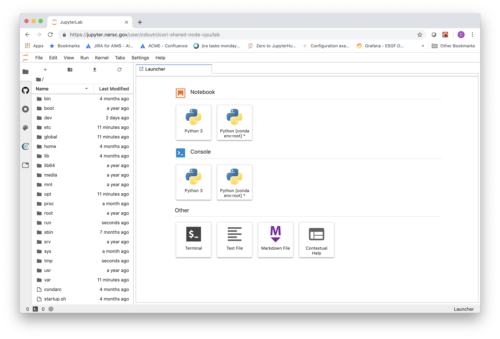
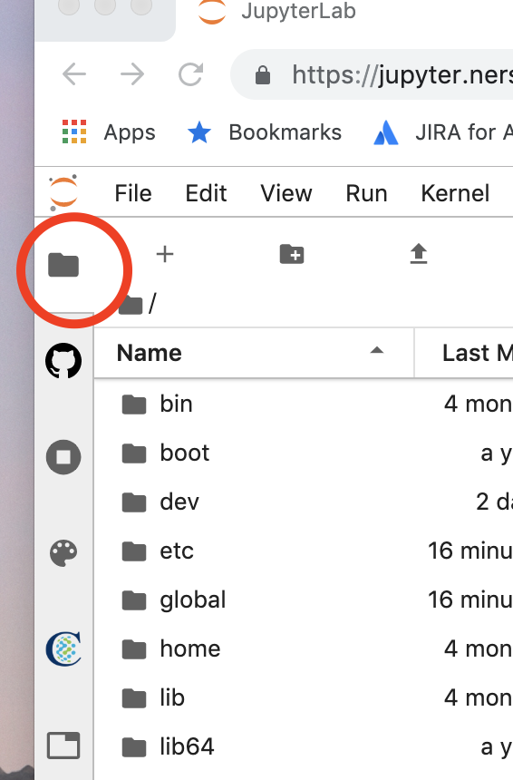
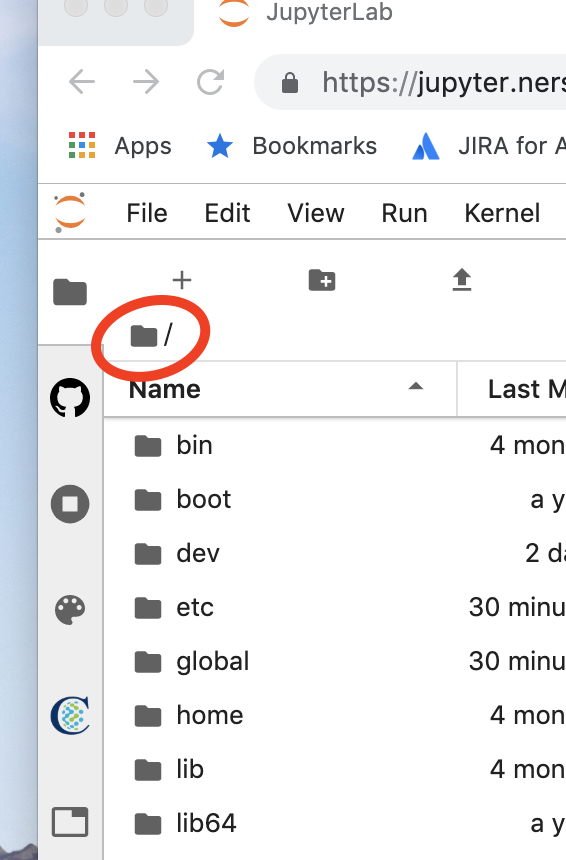
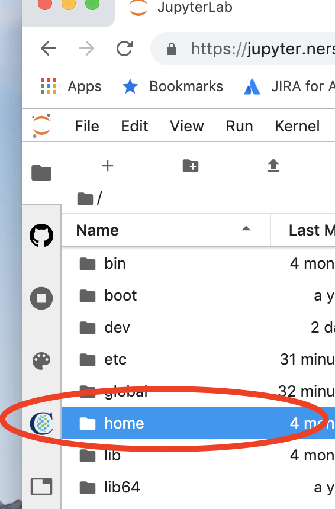
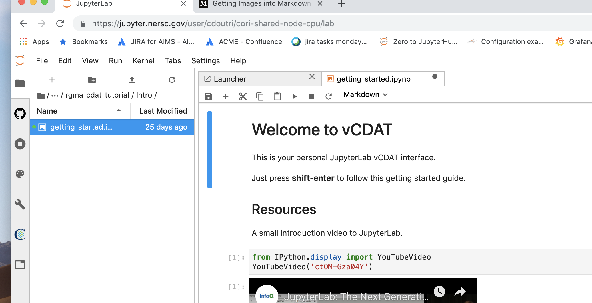

# RGMA CDAT Tutorial

## Setting up

This section is done from any terminal on cori, usually by doing something like:

```
ssh user@cori.nersc.gov
```

### Jupyter

* log into cori and follow instructions [here](https://github.com/CDAT/jupyter-vcdat/wiki/Connecting#using-vcdat-at-nersc)

### Tutorials

* Go to your `$HOME` directory: `cd $HOME`
* Create a symlink to Forrest Hoffman's downloaded data: 
`ln -s /global/cscratch1/sd/cmip6 cmip6_data`

* clone the git repo to get the examples and tutorials: 

`git clone git://github.com/doutriaux1/rgma_cdat_tutorial`

I update the repo frequently to get the latest changes you will probably need to revert the changes generated locally by running the notebooks.

```
cd $HOME/rgma_cdat_tutorial
git checkout -- . 
git pull
```


## Login to Jupyterhub for class

This section is done within a browser, preferably Chrome or Firefox.

### Login

* log to jupyter-hub at: https://jupyter.nersc.gov/hub/login?next=%2Fhub%2Fhome

You should see something like the picture below



### Finding HOME

* Find the "Jupyterlab" file navigator (folder icon at top left, bellow "orange Jupyter" icon and above "github cat icon")



* click on the "home"/"root" button of this navigator.



* then navigate back to your home folder via the `home` directory, followed by the `jovyan` directory. `jovyan` is the container's user but it is mounted onto (linked to) your NERSC `$HOME` directory.



* In the Jupyterlab navigator, go to home and look for the `rgma_cdat_tutorial` folder. This folder contains our notebooks for the CDAT tutorial.

* Navigate down to the `Intro` directory, and click on the [getting started notebook](Intro/getting_started.ipynb). Feel free to watch the video before the class.

